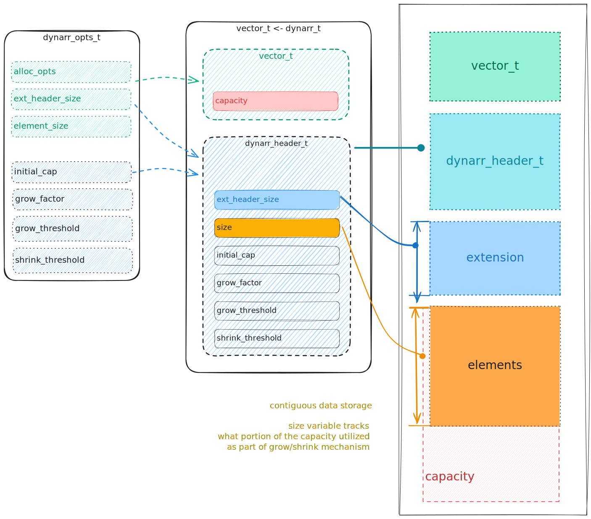

# Dynarr

Generic dynamic array for C.  
Is an extension over [vector](https://github.com/evjeesm/vector).

## Implementation details

Keeps containing data sequential, tracks amount of stored elements
and grows/shrinks on demand.  
Resize functionality is parametrized for flexability.  
Has variety of common array operation, like append, insert, search, etc ...
Vector API can seamlessly operate on `dynarr_t *`.  
Supports further extension.

## Supported platforms

| Platforms | CI/CD | COVERAGE |
|---|---|---|
| Linux |  | [](https://codecov.io/github/evjeesm/dynarr) |
| Windows |  | [](https://codecov.io/github/evjeesm/dynarr) |

[See Full Documentation](https://evjeesm.github.io/dynarr)

## Memory layout


## Dependencies

### Build System

- gcc
- make
- autotools:  
   automake >= 1.11.2  
   autoconf  
   autoconf-archive - install separately (for valgrind support)  
   libtool
- check - testing framework
- valgrind - for memory leak checks
- lcov - for code coverage analizing

### Libraries

- stdlib
- string
- stdbool
- sys/types
- math

### Subprojects:

- [vector](https://github.com/evjeesm/vector)

## Build Process

- Install **Build System** dependencies:

  - On **Debian** / **Ubuntu**:
    - In your fav shell run:
      ```sh
      sudo apt-get install gcc make automake autoconf autoconf-archive libtool \
          check valgrind lcov
      ```
  - On **Windows**:
    - Install [msys2](https://www.msys2.org/) environment.
    - In msys2 shell run:
      ```sh
      pacman -S curl git mingw-w64-ucrt-x86_64-gcc \
          mingw-264-ucrt-x86_64-check \
          autotools autoconf-archive lcov
      ```
      Set up git newline `\n` to `\r\n` convertion (windows style):
      ```sh
      git config --global core.autocrlf input
      ```

- Clone the repository:
  ```sh
  git clone https://github.com/evjeesm/dynarr.git dynarr; cd dynarr;
  git submodule update --init --recursive;
  ```
- Configure project:
  ```sh
  ./autogen.sh && ./configure CFLAGS=<YOUR COMPILATION FLAGS> --prefix=</path/to/install/folder/>
  ```
- Build project: (use -j<threads> option for multithreaded building)
  ```sh
  make
  ```
- Run Tests:
  ```sh
  make check
  make check-valgrind    # optional memory check
  ```
- If no errors occured during _check_ you can safely install library  
  in your desired prefix path that you specified at configure step.  
  Procede to installation:
  ```sh
  make install
  ```

## Usage

Link against `libdynarr_static.a` or `libdynarr.so` on **linux**.  
If you on **Windows** platform link to `libdynarr_static.lib`.

Requires standard math library, so remember to provide `-lm`.  
Requires linking with vector's libraries.

### Minimal Example

```c
#include "dynarr.h"

int main(void)
{
    dynarr_t *dynarr = dynarr_create(.element_size = sizeof(int));
    int a = 69;
    dynarr_append(&dynarr, &a);
    dynarr_append(&dynarr, TMP_REF(int, 42));

    dynarr_last(dynarr, &a); // a = 42
    dynarr_destroy(dynarr);
}
```
